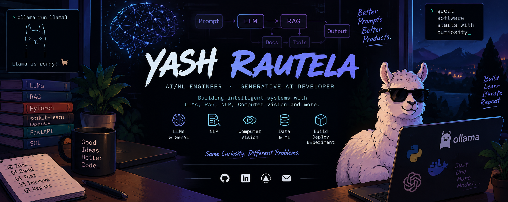

<div align="center">



</div>

---

## 👋 About Me

Hi! I'm Yash, a **B.Tech CSE graduate** with a strong interest in
**Machine Learning, Generative AI, LLMs, NLP, and Computer Vision**.

I enjoy building practical AI applications and experimenting with
new technologies to turn ideas into working solutions.

---

## 🛠️ Skills

### 🐍 Languages


### 🤖 AI / Machine Learning


### 🧠 LLM & AI Development


### 🔧 APIs & Tools


---

## 🧠 AI & Generative AI

I'm interested in building practical AI applications using modern
Generative AI and Machine Learning techniques.

```text
🧠 Large Language Models (LLMs)
🔎 Retrieval-Augmented Generation (RAG)
🤖 AI Agents
🦙 Local LLMs with Ollama
💬 Natural Language Processing (NLP)
👁️ Computer Vision
```

---

<h2 align="center">🤝 Connect with me</h2>

<p align="center">
  <a href="https://www.linkedin.com/in/yash-rautela-11ba0925a/">
    
  </a>
  &nbsp;&nbsp;
  <a href="mailto:yashsing.rautela2004@gmail.com">
    
  </a>
  &nbsp;&nbsp;
  <a href="https://x.com/yashXrautela">
    
  </a>
  &nbsp;&nbsp;
  <a href="https://www.instagram.com/raiseuryayayash/">
    
  </a>
</p>
